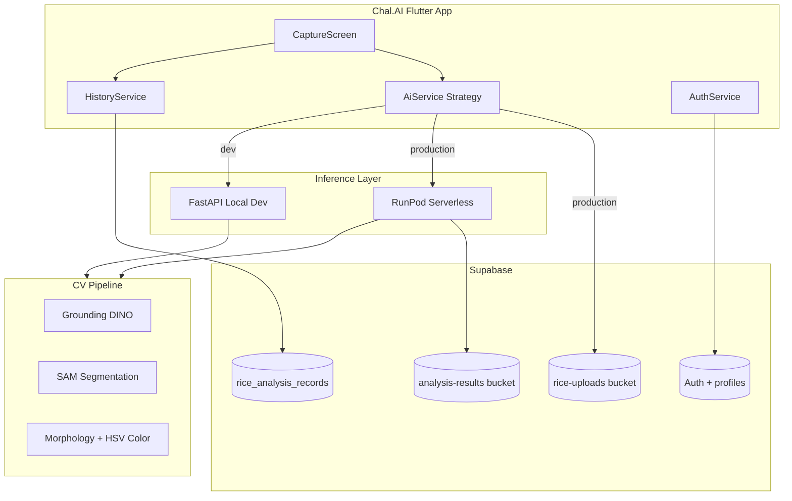
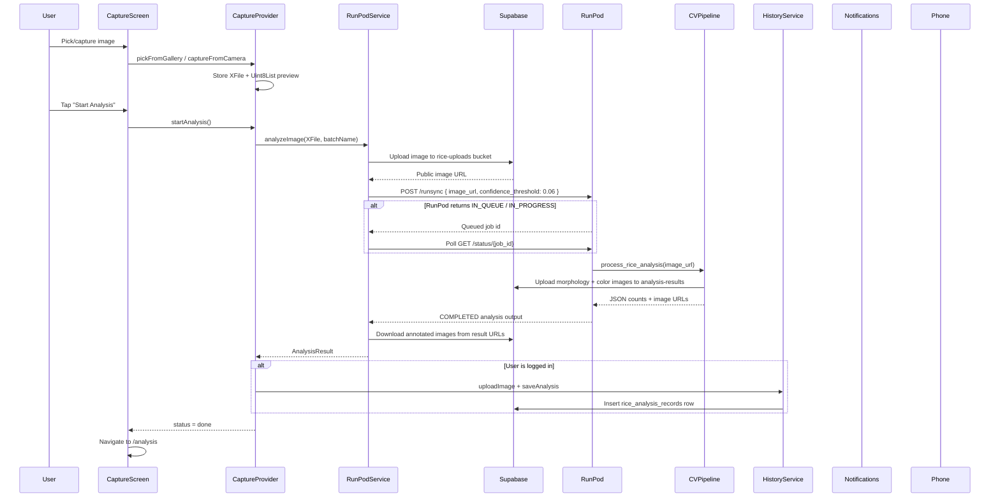

# Chal.AI — Rice Grain Analyzer System

**Chal.AI** is an AI-powered mobile and web application for analyzing rice grain quality. Users capture or upload a photo of rice grains, and the system detects individual grains, classifies morphology defects (broken grains, impurities), detects color anomalies, and computes an **integrity score** representing the percentage of healthy grains.

This document covers the full monorepo architecture, data flow, Supabase/RunPod integration, and all commands needed to run and build the project.

---

## Table of Contents

1. [Project Overview](#1-project-overview)
2. [Repository Structure](#2-repository-structure)
3. [Tech Stack](#3-tech-stack)
4. [Architecture](#4-architecture)
5. [Data Flow](#5-data-flow)
6. [Flutter App Modules](#6-flutter-app-modules)
7. [Backend Modules](#7-backend-modules)
8. [Supabase Setup](#8-supabase-setup)
9. [Environment Configuration](#9-environment-configuration)
10. [Commands Reference](#10-commands-reference)
11. [User Flows](#11-user-flows)
12. [Known Limitations](#12-known-limitations)

---

## 1. Project Overview

The system is a **monorepo** with two main components:

| Component | Path | Purpose |
|-----------|------|---------|
| **Flutter Client** | [`Chal.AI/`](../Chal.AI/) | Cross-platform app (Android, iOS, Web) for capture, results, history, and reports |
| **Python Backend** | [`rice_analysis_backend/`](../rice_analysis_backend/) | Computer-vision pipeline using Grounding DINO + SAM for grain detection and quality analysis |

### What the system does

1. **Detect** individual rice grains in a photo using Grounding DINO (open-vocabulary object detection).
2. **Segment** each grain using SAM (Segment Anything Model).
3. **Classify morphology** — Healthy, 3/4 Broken, Half Broken, Impurity/Dust — based on area ratios.
4. **Detect color anomalies** — Discolored grains via HSV color space analysis.
5. **Compute integrity score** — percentage of healthy grains out of total detected.
6. **Generate annotated images** — morphology overlay and color overlay for visual inspection.
7. **Persist history** — save results to Supabase for authenticated users.

ML inference runs **entirely on the server** (PyTorch + Hugging Face Transformers). There is no on-device TFLite or ONNX model in the current codebase.

---

## 2. Repository Structure

```
Chal.AI-A-Rice-Grain-Analyzer-System/
├── Chal.AI/                        # Flutter application
│   ├── lib/
│   │   ├── main.dart               # App entry point
│   │   ├── core/                   # Router, theme, config, providers, localization
│   │   └── features/               # Feature modules (auth, capture, analysis, history, …)
│   ├── android/                    # Android native project (Gradle, signing)
│   ├── ios/                        # iOS native project
│   ├── web/                        # Web platform entry
│   ├── assets/                     # Static assets (images, icons)
│   ├── pubspec.yaml                # Flutter dependencies
│   └── .env.json                   # Build-time secrets (gitignored)
│
├── rice_analysis_backend/          # Python CV backend
│   ├── app/
│   │   ├── main.py                 # FastAPI application
│   │   ├── api/                    # HTTP layer (routes, auth, rate limiting)
│   │   ├── core/                   # Settings, ML model lifecycle
│   │   ├── services/               # CV pipeline, inference, image processing
│   │   ├── schemas/                # Pydantic request/response models
│   │   └── models/                 # Cached DINO + SAM weights (gitignored)
│   ├── run_serverless.py           # RunPod serverless worker entrypoint
│   ├── download_weights.py         # One-time model weight download
│   ├── local_test.py               # Local pipeline test (no HTTP)
│   ├── Dockerfile                  # GPU container for RunPod
│   ├── requirements.txt            # Python dependencies
│   └── .env                        # Backend secrets (gitignored)
│
└── docs/
    └── PROJECT.md                  # This file
```

---

## 3. Tech Stack

### Flutter Client (`Chal.AI/`)

| Layer | Technology |
|-------|------------|
| Framework | Flutter (Dart SDK `>=3.4.0 <4.0.0`, app v1.1.0+2) |
| State management | [flutter_riverpod](https://pub.dev/packages/flutter_riverpod) |
| Navigation | [go_router](https://pub.dev/packages/go_router) |
| Auth & database | [supabase_flutter](https://pub.dev/packages/supabase_flutter) |
| Image capture | [image_picker](https://pub.dev/packages/image_picker) |
| Charts | [fl_chart](https://pub.dev/packages/fl_chart) |
| PDF export | [pdf](https://pub.dev/packages/pdf), [share_plus](https://pub.dev/packages/share_plus) |
| HTTP | [http](https://pub.dev/packages/http) |
| Localization | English + Bengali |

### Python Backend (`rice_analysis_backend/`)

| Layer | Technology |
|-------|------------|
| HTTP (dev) | FastAPI + Uvicorn |
| Production inference | RunPod Serverless |
| Object detection | Grounding DINO (`IDEA-Research/grounding-dino-base`) |
| Segmentation | SAM (`facebook/sam-vit-base`) |
| Deep learning | PyTorch 2.4 + CUDA 12.4 |
| Computer vision | OpenCV (headless), NumPy |
| Validation | Pydantic v2 |
| Rate limiting | slowapi (20 requests/minute) |

### Infrastructure

| Service | Role |
|---------|------|
| **Supabase** | User auth, profiles, analysis history, image storage |
| **RunPod** | GPU serverless inference in production |
| **FastAPI** (local) | Direct multipart image upload for development |

---

## 4. Architecture

The app supports three AI backend modes, selected at **compile time** via `--dart-define` flags:

| Mode | Flag | Service | Use Case |
|------|------|---------|----------|
| **Production** (default) | *(none)* | `RunPodAiService` | Real inference via RunPod + Supabase |
| **Local dev** | `USE_RUNPOD=false` | `RealAiService` | Direct POST to local FastAPI server |
| **Mock/demo** | `USE_MOCK=true` | `MockAiService` | Instant fake results, no network |



### CV Pipeline (backend)

```
Image bytes
  → Decode & resize (max 1280px)
  → Grounding DINO — detect grains ("white rice grain." prompt)
  → SAM — segment each bounding box
  → Morphology analysis — classify by area ratio vs median
  → HSV color analysis — flag discolored grains
  → Draw annotated morphology + color images
  → Compute integrity score and grain counts
  → Return JSON (+ base64 images for FastAPI, or Supabase URLs for RunPod)
```

Source: [`rice_analysis_backend/app/services/cv_pipeline.py`](../rice_analysis_backend/app/services/cv_pipeline.py)

---

## 5. Data Flow

### 5.1 Production Path (RunPod + Supabase) — Default

This is the path used when running with `--dart-define-from-file=.env.json` and no mock/local flags.



**Key files:**

| Step | File |
|------|------|
| Capture state machine | [`Chal.AI/lib/features/capture/presentation/providers/capture_provider.dart`](../Chal.AI/lib/features/capture/presentation/providers/capture_provider.dart) |
| RunPod AI service | [`Chal.AI/lib/features/analysis/data/services/runpod_ai_service.dart`](../Chal.AI/lib/features/analysis/data/services/runpod_ai_service.dart) |
| RunPod worker | [`rice_analysis_backend/run_serverless.py`](../rice_analysis_backend/run_serverless.py) |
| Inference orchestrator | [`rice_analysis_backend/app/services/inference.py`](../rice_analysis_backend/app/services/inference.py) |
| CV pipeline | [`rice_analysis_backend/app/services/cv_pipeline.py`](../rice_analysis_backend/app/services/cv_pipeline.py) |
| Domain model | [`Chal.AI/lib/features/analysis/domain/models/analysis_result.dart`](../Chal.AI/lib/features/analysis/domain/models/analysis_result.dart) |
| History persistence | [`Chal.AI/lib/features/history/data/services/history_service.dart`](../Chal.AI/lib/features/history/data/services/history_service.dart) |

**Capture state machine:**

```
idle → imageSelected → analyzing → done | error
```

### 5.2 Local Development Path (FastAPI)

Used with `--dart-define=USE_RUNPOD=false` and a running local FastAPI server.

```
CaptureScreen
  → CaptureProvider.startAnalysis()
  → RealAiService.analyzeImage()
  → POST multipart/form-data to http://<lan-ip>:8000/api/v1/rice
  → FastAPI loads DINO + SAM at startup (ml_manager.py)
  → cv_pipeline.py runs full analysis
  → Response includes base64-encoded annotated images
  → Parsed into AnalysisResult
  → Navigate to /analysis
```

**Key files:**

| Step | File |
|------|------|
| Local AI service | [`Chal.AI/lib/features/analysis/data/services/real_ai_service.dart`](../Chal.AI/lib/features/analysis/data/services/real_ai_service.dart) |
| FastAPI endpoint | [`rice_analysis_backend/app/api/v1/endpoints/analyze.py`](../rice_analysis_backend/app/api/v1/endpoints/analyze.py) |
| API config | [`Chal.AI/lib/core/config/api_config.dart`](../Chal.AI/lib/core/config/api_config.dart) |

> **Note:** When testing on a physical Android device, use your machine's LAN IP (not `localhost`) and ensure cleartext HTTP is allowed — already configured in [`Chal.AI/android/app/src/main/AndroidManifest.xml`](../Chal.AI/android/app/src/main/AndroidManifest.xml).

### 5.3 Mock Path (No Backend)

Used with `--dart-define=USE_MOCK=true` for UI development and demos.

```
CaptureScreen → CaptureProvider → MockAiService → instant fake AnalysisResult → /analysis
```

No network calls. No Supabase upload. History save still works if logged in (with mock data).

**Key file:** [`Chal.AI/lib/features/analysis/data/services/mock_ai_service.dart`](../Chal.AI/lib/features/analysis/data/services/mock_ai_service.dart)

### 5.4 AI Service Selection

Wired in `capture_provider.dart`:

```dart
// --dart-define=USE_MOCK=true    → MockAiService  (no backend, instant demo)
// --dart-define=USE_RUNPOD=false → RealAiService  (local FastAPI dev server)
// default                         → RunPodAiService (production)
const bool _useMock = bool.fromEnvironment('USE_MOCK', defaultValue: false);
const bool _useRunPod = bool.fromEnvironment('USE_RUNPOD', defaultValue: true);
```

---

## 6. Flutter App Modules

The app follows a **feature-first** folder structure under `Chal.AI/lib/features/`.

### Feature modules

| Module | Path | Responsibility |
|--------|------|----------------|
| **Auth** | `lib/features/auth/` | Supabase sign-up/in, password reset, profile setup and editing |
| **Capture** | `lib/features/capture/` | Image pick (camera/gallery), batch name, analysis trigger |
| **Analysis** | `lib/features/analysis/` | Result display, AI service layer (RunPod/local/mock) |
| **History** | `lib/features/history/` | Past analyses CRUD from Supabase |
| **Report** | `lib/features/report/` | Detailed report with charts, PDF generation, share |
| **Settings** | `lib/features/settings/` | Theme mode, language preferences |
| **Guidelines** | `lib/features/guidelines/` | Capture and analysis instructions for users |
| **Splash** | `lib/features/splash/` | Initial loading screen |

### Core modules (`lib/core/`)

| Module | Path | Responsibility |
|--------|------|----------------|
| **Router** | `core/router/app_router.dart` | All routes, auth/profile redirect guards |
| **Config** | `core/config/api_config.dart` | Backend URL, RunPod, Supabase constants |
| **Theme** | `core/theme/app_theme.dart` | Light/dark Material themes |
| **Providers** | `core/providers/` | Theme mode, language (en/bn) |
| **Localization** | `core/localization/app_strings.dart` | English and Bengali strings |
| **Widgets** | `core/widgets/` | Shared UI (sidebar, logo) |

### Routes

Defined in [`Chal.AI/lib/core/router/app_router.dart`](../Chal.AI/lib/core/router/app_router.dart):

| Route | Screen | Auth Required |
|-------|--------|---------------|
| `/splash` | SplashScreen | No |
| `/` | CaptureScreen (home) | Yes |
| `/analysis` | AnalysisResultScreen | Yes |
| `/report` | DetailedReportScreen | Yes |
| `/login` | LoginScreen | No |
| `/signup` | SignupScreen | No |
| `/forgot-password` | ForgotPasswordScreen | No |
| `/reset-password` | ResetPasswordScreen | No |
| `/profile-setup` | ProfileSetupScreen | Yes (first time) |
| `/profile` | ProfileScreen | Yes |
| `/history` | HistoryScreen | Yes |
| `/settings` | SettingsScreen | Yes |
| `/guidelines` | UserGuidelinesScreen | Yes |

**Auth guards:** Unauthenticated users are redirected to `/login`. Authenticated users without a `profiles` row are redirected to `/profile-setup`.

### State management (Riverpod)

| Provider | File | Type | Purpose |
|----------|------|------|---------|
| `captureProvider` | `capture/presentation/providers/capture_provider.dart` | `StateNotifier<CaptureState>` | Capture + analysis lifecycle |
| `aiServiceProvider` | same file | `Provider<AiService>` | Swaps mock/local/RunPod |
| `authStateProvider` | `auth/presentation/providers/auth_provider.dart` | `StreamProvider<AppUser?>` | Supabase auth stream |
| `currentUserProvider` | same | `Provider<AppUser?>` | Sync user read |
| `profileNotifierProvider` | `auth/presentation/providers/profile_provider.dart` | `AsyncNotifierProvider` | User profile CRUD |
| `historyProvider` | `history/presentation/providers/history_provider.dart` | `AsyncNotifierProvider` | Analysis history list |
| `languageProvider` | `core/providers/language_provider.dart` | `StateNotifierProvider` | en/bn locale |
| `themeModeProvider` | `core/providers/theme_provider.dart` | Theme mode |
| `appRouterProvider` | `core/router/app_router.dart` | `Provider<GoRouter>` | Navigation |

App bootstrap in [`Chal.AI/lib/main.dart`](../Chal.AI/lib/main.dart):

1. Initialize Supabase with URL and anon key from `ApiConfig`
2. Set portrait-only orientation and edge-to-edge UI
3. Wrap in `ProviderScope` (Riverpod)
4. `ChalAiApp` watches router, theme, and language providers

### AnalysisResult domain model

The core result object passed between screens via GoRouter's `extra` parameter:

| Field | Type | Description |
|-------|------|-------------|
| `id` | String | Unique analysis ID |
| `batchName` | String | User-provided batch label |
| `integrityScore` | double | Percentage of healthy grains |
| `counts` | `GrainCounts` | healthy, threeQuarterBroken, halfBroken, impurity, discolored |
| `morphologyImageBytes` | `Uint8List?` | Annotated morphology image |
| `colorImageBytes` | `Uint8List?` | Annotated color image |
| `processingTime` | `Duration` | Inference duration |
| `detectedVariety` | String | Rice variety (placeholder) |
| `lengthDistribution` | `GrainLengthDistribution` | Short/medium/long percentages (placeholder) |
| `defectBreakdown` | `DefectBreakdown` | Chalky, red-streaked, etc. (placeholder) |

---

## 7. Backend Modules

### Entry points

| Entry | File | Use Case |
|-------|------|----------|
| HTTP server | [`app/main.py`](../rice_analysis_backend/app/main.py) | Local dev: `uvicorn app.main:app` |
| Serverless worker | [`run_serverless.py`](../rice_analysis_backend/run_serverless.py) | Production RunPod GPU container |
| Local test | [`local_test.py`](../rice_analysis_backend/local_test.py) | Direct pipeline call, no HTTP |
| Weight download | [`download_weights.py`](../rice_analysis_backend/download_weights.py) | Pre-cache DINO + SAM to `app/models/` |

### Services

| Module | File | Responsibility |
|--------|------|----------------|
| **ML Manager** | `app/core/ml_manager.py` | Load/unload DINO + SAM; GPU/CPU device selection |
| **CV Pipeline** | `app/services/cv_pipeline.py` | DINO detect → SAM segment → morphology → HSV color → annotate |
| **Inference** | `app/services/inference.py` | URL-based pipeline for RunPod (`process_rice_analysis`) |
| **Image Processing** | `app/services/image_processing.py` | Bytes → RGB, resize for inference |
| **Supabase Client** | `app/services/supabase_client.py` | Download input images, upload result images |
| **Analyze Endpoint** | `app/api/v1/endpoints/analyze.py` | `POST /api/v1/rice` — multipart upload wrapper |
| **Schemas** | `app/schemas/analysis.py` | Pydantic models mirroring Flutter `AnalysisResult` |
| **Dependencies** | `app/api/dependencies.py` | Rate limiter (20/min), optional `X-Api-Key` auth |
| **Config** | `app/core/config.py` | Pydantic settings from `.env` |

### API endpoints (FastAPI)

| Method | Path | Description |
|--------|------|-------------|
| `GET` | `/` | Health check |
| `GET` | `/health` | Readiness probe |
| `POST` | `/api/v1/rice` | Analyze rice image (multipart `file` + `batch_name`) |
| `GET` | `/docs` | Swagger UI (development only) |

### ML models

| Model | Hugging Face ID | Purpose |
|-------|-----------------|---------|
| Grounding DINO | `IDEA-Research/grounding-dino-base` | Open-vocabulary grain detection |
| SAM | `facebook/sam-vit-base` | Instance segmentation per detected box |

Models are pinned to `transformers==4.44.2`. Weights are cached locally via `download_weights.py` or downloaded at runtime from Hugging Face.

### Morphology classification thresholds

Grains are classified by comparing their segmented area to the median grain area:

| Category | Area Ratio vs Median |
|----------|---------------------|
| Healthy | ≥ 0.85 |
| 3/4 Broken | 0.60 – 0.85 |
| Half Broken | 0.35 – 0.60 |
| Impurity/Dust | < 0.35 |

Color anomalies use HSV distance from the median healthy grain color, weighted by hue (1.0) and saturation (0.5), with a threshold of 15.0.

---

## 8. Supabase Setup

The app requires a Supabase project with the following configuration.

### Authentication

Enable email/password auth in the Supabase Dashboard. The Flutter app uses `supabase_flutter` for sign-up, sign-in, and password recovery.

### Database tables

#### `profiles`

Referenced by [`Chal.AI/lib/features/auth/data/services/profile_service.dart`](../Chal.AI/lib/features/auth/data/services/profile_service.dart).

| Column | Type | Notes |
|--------|------|-------|
| `id` | uuid (PK) | Matches Supabase auth user ID |
| `first_name` | text | |
| `last_name` | text | |
| `phone_number` | text | |
| `location` | text | |
| `designation` | text (nullable) | |
| `email` | text | |
| `updated_at` | timestamptz | |

#### `rice_analysis_records`

Referenced by [`Chal.AI/lib/features/history/data/services/history_service.dart`](../Chal.AI/lib/features/history/data/services/history_service.dart).

```sql
CREATE TABLE rice_analysis_records (
    id                   uuid PRIMARY KEY DEFAULT gen_random_uuid(),
    user_id              uuid NOT NULL REFERENCES auth.users(id),
    batch_name           text NOT NULL,
    analyzed_at          timestamptz NOT NULL,
    processing_time_ms   integer NOT NULL,
    integrity_score      real NOT NULL,
    counts               jsonb NOT NULL,
    morphology_report    jsonb NOT NULL,
    color_report         jsonb NOT NULL,
    morphology_image_url text,
    color_image_url      text,
    created_at           timestamptz DEFAULT now()
);
```

The `counts` JSONB stores: `healthy`, `threeQuarterBroken`, `halfBroken`, `impurity`, `discolored`.

### Storage buckets

| Bucket | Access | Used By | Purpose |
|--------|--------|---------|---------|
| `rice-uploads` | **Public** | Flutter app | Input images uploaded before RunPod inference. Must be public so RunPod can fetch the URL without auth. |
| `analysis-results` | Private (service role) | Backend worker | Annotated morphology and color result images from RunPod |

---

## 9. Environment Configuration

All secret files are **gitignored** and must be created locally.

### Flutter — `Chal.AI/.env.json`

Injected at build/run time via `--dart-define-from-file=.env.json`.

```json
{
  "SUPABASE_URL": "https://<project-id>.supabase.co",
  "SUPABASE_ANON_KEY": "<your-anon-key>",
  "SUPABASE_UPLOAD_BUCKET": "rice-uploads",
  "RUNPOD_ENDPOINT_ID": "<your-runpod-endpoint-id>",
  "RUNPOD_API_KEY": "<your-runpod-api-key>",
  "LOCAL_API_BASE_URL": "http://192.168.1.105:8000"
}
```

Read by [`Chal.AI/lib/core/config/api_config.dart`](../Chal.AI/lib/core/config/api_config.dart).

| Variable | Required | Default | Purpose |
|----------|----------|---------|---------|
| `SUPABASE_URL` | Yes | `""` | Supabase project URL |
| `SUPABASE_ANON_KEY` | Yes | `""` | Supabase anonymous key |
| `SUPABASE_UPLOAD_BUCKET` | No | `rice-uploads` | Input image upload bucket |
| `RUNPOD_ENDPOINT_ID` | Yes (prod) | `""` | RunPod serverless endpoint |
| `RUNPOD_API_KEY` | Yes (prod) | `""` | RunPod API key |
| `LOCAL_API_BASE_URL` | No | `http://localhost:8000` | Local FastAPI backend URL |
| `USE_MOCK` | No | `false` | Enable mock AI service |
| `USE_RUNPOD` | No | `true` | Use RunPod vs local FastAPI |

`USE_MOCK` and `USE_RUNPOD` are passed as separate `--dart-define` flags, not in `.env.json`.

### Backend — `rice_analysis_backend/.env`

Loaded by [`rice_analysis_backend/app/core/config.py`](../rice_analysis_backend/app/core/config.py).

```env
# Application
APP_ENV=development
APP_HOST=0.0.0.0
APP_PORT=8000

# Security (optional in dev; required in production)
API_SECRET_KEY=
CORS_ALLOWED_ORIGINS=*

# Upload limits
MAX_UPLOAD_SIZE_BYTES=10485760

# Model identifiers
DINO_MODEL_ID=IDEA-Research/grounding-dino-base
SAM_MODEL_ID=facebook/sam-vit-base

# Detection thresholds
DINO_TEXT_PROMPT=white rice grain.
DINO_BOX_THRESHOLD=0.06
DINO_IOU_THRESHOLD=0.6

# Color analysis
COLOR_H_WEIGHT=1.0
COLOR_S_WEIGHT=0.5
COLOR_ANOMALY_THRESHOLD=15.0

# Supabase (required for RunPod worker)
SUPABASE_URL=https://<project-id>.supabase.co
SUPABASE_KEY=<service-role-key>
SUPABASE_RESULTS_BUCKET=analysis-results
```

| Variable | Default | Notes |
|----------|---------|-------|
| `APP_ENV` | `development` | Set to `production` to disable `/docs` |
| `API_SECRET_KEY` | `""` | If set, clients must send `X-Api-Key` header |
| `CORS_ALLOWED_ORIGINS` | `*` | Comma-separated in production |
| `SUPABASE_KEY` | `""` | Service-role key (not anon key) for backend uploads |

### Android release signing — `Chal.AI/android/key.properties`

Required for release APK and AAB builds:

```properties
storePassword=<password>
keyPassword=<password>
keyAlias=<alias>
storeFile=<path-to-keystore.jks>
```

Referenced in [`Chal.AI/android/app/build.gradle.kts`](../Chal.AI/android/app/build.gradle.kts). Debug builds do not require this file.

---

## 10. Commands Reference

### Prerequisites

- **Flutter** stable channel (Dart `>=3.4.0 <4.0.0`)
- **Android SDK** for APK builds (Gradle 8.12, AGP 8.9.1)
- **Xcode** for iOS builds (macOS only)
- **Python 3** with **PyTorch** (CUDA recommended for ML inference)
- **Docker** + NVIDIA GPU runtime for containerized ML deployment
- **Supabase project** with auth, tables, and storage buckets configured
- **RunPod Serverless endpoint** for production inference

---

### Flutter — Initial Setup

```bash
cd Chal.AI
flutter pub get
```

Create `Chal.AI/.env.json` with your Supabase and RunPod credentials (see [Environment Configuration](#9-environment-configuration)).

---

### Flutter — Run / Debug

**Production mode (RunPod + Supabase):**

```bash
cd Chal.AI
flutter run --dart-define-from-file=.env.json
```

**Local FastAPI backend (phone on same WiFi as dev machine):**

```bash
cd Chal.AI
flutter run --dart-define-from-file=.env.json \
  --dart-define=USE_RUNPOD=false \
  --dart-define=LOCAL_API_BASE_URL=http://192.168.1.105:8000
```

Replace `192.168.1.105` with your machine's LAN IP (`ipconfig` on Windows, `ifconfig en0` on macOS).

**Mock/demo mode (no backend, instant results):**

```bash
cd Chal.AI
flutter run --dart-define=USE_MOCK=true
```

**Platform-specific:**

```bash
flutter run -d android
flutter run -d ios          # macOS + Xcode required
flutter run -d chrome       # web
flutter run --debug         # default debug mode
flutter run --profile       # performance profiling
flutter run --release       # release mode on device
```

---

### Flutter — Build APK

**Release APK (requires `android/key.properties`):**

```bash
cd Chal.AI
flutter build apk --dart-define-from-file=.env.json
```

Output: `Chal.AI/build/app/outputs/flutter-apk/app-release.apk`

**Debug APK (no signing file needed):**

```bash
cd Chal.AI
flutter build apk --debug
```

Output: `Chal.AI/build/app/outputs/flutter-apk/app-debug.apk`

**Split APKs per ABI (smaller download size):**

```bash
cd Chal.AI
flutter build apk --split-per-abi --dart-define-from-file=.env.json
```

---

### Flutter — Build AAB (Google Play Store)

```bash
cd Chal.AI
flutter build appbundle --dart-define-from-file=.env.json
```

Output: `Chal.AI/build/app/outputs/bundle/release/app-release.aab`

Requires `android/key.properties` with a valid release keystore.

---

### Flutter — Build Web

```bash
cd Chal.AI
flutter build web --dart-define-from-file=.env.json
```

Output: `Chal.AI/build/web/`

---

### Flutter — Other Commands

```bash
cd Chal.AI
flutter analyze                          # static analysis
flutter test                             # run unit tests
dart run flutter_launcher_icons          # regenerate app icons from pubspec config
flutter devices                          # list connected devices/emulators
flutter clean && flutter pub get         # clean rebuild
```

---

### Backend — Initial Setup

```bash
cd rice_analysis_backend
python -m venv .venv
source .venv/bin/activate                # Windows: .venv\Scripts\activate
```

Install PyTorch first (not included in `requirements.txt` to avoid overwriting CUDA builds):

```bash
# GPU (CUDA 12.4):
pip install torch torchvision --index-url https://download.pytorch.org/whl/cu124

# CPU only:
pip install torch torchvision
```

Then install remaining dependencies:

```bash
pip install -r requirements.txt
```

Create `rice_analysis_backend/.env` with your settings (see [Environment Configuration](#9-environment-configuration)).

Download model weights (recommended for local dev — avoids runtime Hugging Face downloads):

```bash
python download_weights.py
```

Weights are saved to `app/models/dino/` and `app/models/sam/`.

---

### Backend — Run FastAPI Dev Server

```bash
cd rice_analysis_backend
source .venv/bin/activate
uvicorn app.main:app --host 0.0.0.0 --port 8000 --reload
```

Endpoints:
- Health: `GET http://localhost:8000/` and `GET http://localhost:8000/health`
- Analyze: `POST http://localhost:8000/api/v1/rice`
- Swagger UI: `GET http://localhost:8000/docs` (development only)

Pair with Flutter using `--dart-define=USE_RUNPOD=false`.

First startup loads DINO + SAM models into memory — expect a delay of 30–60 seconds.

---

### Backend — Local Pipeline Test (No HTTP)

Test the CV pipeline directly without starting a server:

```bash
cd rice_analysis_backend
source .venv/bin/activate
python local_test.py

# With a custom image URL:
python local_test.py "https://example.com/rice.jpg"
```

Optional environment variables: `TEST_IMAGE_URL`, `TEST_THRESHOLD` (default `0.06`).

---

### Backend — Supabase Integration Test

```bash
cd rice_analysis_backend
source .venv/bin/activate
python -m tests.test_supabase_connection
```

Requires `.env` with `SUPABASE_URL` + `SUPABASE_KEY`, bucket `analysis-results`, and table `rice_analysis_records`.

---

### Backend — Docker (RunPod Deployment)

Build the GPU container:

```bash
cd rice_analysis_backend
docker build -t <dockerhub-user>/rice-analyzer-serverless:latest .
```

Push to a container registry:

```bash
docker push <dockerhub-user>/rice-analyzer-serverless:latest
```

Deploy the image to a **RunPod Serverless** endpoint. The container runs:

```bash
python -u run_serverless.py
```

Set these environment variables on the RunPod endpoint:

```
SUPABASE_URL=https://<project-id>.supabase.co
SUPABASE_KEY=<service-role-key>
SUPABASE_RESULTS_BUCKET=analysis-results
```

Base image: `pytorch/pytorch:2.4.0-cuda12.4-cudnn9-runtime`

---

### End-to-End Workflows

#### A. Production (RunPod + Supabase)

```bash
# 1. Deploy Docker image to RunPod Serverless (see Docker section above)

# 2. Run Flutter app
cd Chal.AI
flutter pub get
flutter run --dart-define-from-file=.env.json

# 3. Build release APK for distribution
flutter build apk --dart-define-from-file=.env.json
```

#### B. Local Full-Stack Development

```bash
# Terminal 1 — Backend
cd rice_analysis_backend
source .venv/bin/activate
pip install torch torchvision --index-url https://download.pytorch.org/whl/cu124
pip install -r requirements.txt
python download_weights.py
uvicorn app.main:app --host 0.0.0.0 --port 8000 --reload

# Terminal 2 — Flutter (replace IP with your LAN address)
cd Chal.AI
flutter pub get
flutter run --dart-define-from-file=.env.json \
  --dart-define=USE_RUNPOD=false \
  --dart-define=LOCAL_API_BASE_URL=http://192.168.1.105:8000
```

#### C. UI-Only Demo (No Backend)

```bash
cd Chal.AI
flutter run --dart-define=USE_MOCK=true
```

---

## 11. User Flows

### App launch

```
SplashScreen (2.2s delay)
  → Auth check via authStateProvider
  → Not authenticated → /login
  → Authenticated, no profile → /profile-setup
  → Authenticated, profile exists → / (CaptureScreen)
```

Password recovery deep links are handled in `main.dart` via `authEventStreamProvider` → redirect to `/reset-password`.

### Analyze rice (core flow)

```
CaptureScreen
  → User picks image from camera or gallery
  → Preview shown (Image.memory from Uint8List)
  → User enters batch name (default: "Batch A")
  → User taps "Start Analysis"
  → AnalyzingOverlay shown while inference runs
  → On success: navigate to /analysis with AnalysisResult
  → User can tap "View Full Report" → /report (PDF-style detailed report)
  → captureProvider.reset() clears state for next capture
```

### History

```
HistoryScreen (watches historyProvider)
  → Fetches rice_analysis_records for current user
  → Tap a record → rehydrate AnalysisResult from stored JSON
  → Navigate to /analysis or /report
  → Swipe/delete → historyProvider.delete()
```

### Authentication

```
LoginScreen / SignupScreen
  → Supabase AuthService (email + password)
  → On success: check profiles table
  → No profile row → /profile-setup (first name, last name, phone, location)
  → Profile exists → / (CaptureScreen)

Forgot password → email sent → deep link → /reset-password
```

### Settings

```
SettingsScreen
  → Toggle theme (light / dark / system) via themeModeProvider
  → Switch language (English / Bengali) via languageProvider
  → Persisted locally via shared_preferences
```

---

## 12. Known Limitations

- **`camera` package unused:** Listed in `pubspec.yaml` but capture uses `image_picker` only (system camera via `ImageSource.camera`).
- **Placeholder analysis fields:** `detectedVariety`, `lengthDistribution`, and `defectBreakdown` in `AnalysisResult` return default/placeholder values — not yet computed by the CV pipeline.
- **Model weights not in git:** Downloaded via `download_weights.py` or fetched from Hugging Face at runtime. First inference is slow while models load.
- **Secret files gitignored:** `.env.json`, `.env`, and `key.properties` must be created locally before running or building.
- **Android cleartext HTTP:** Enabled in the manifest for local dev (`LOCAL_API_BASE_URL` over HTTP). Use HTTPS in production.
- **No CI/CD:** No GitHub Actions workflows, Makefile, or shell scripts in the repo.
- **Release signing required:** Release APK/AAB builds fail without `android/key.properties` and a valid keystore.
- **GPU recommended:** Local ML inference is very slow on CPU. CUDA GPU or RunPod serverless is recommended for usable performance.
